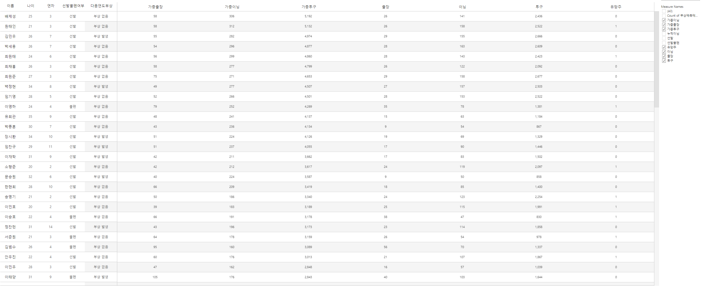

# 다층 신경망을 이용한 KBO리그 투수 2022년 부상 예측 프로젝트

**1. 다층 퍼셉트론 이용한 모델 생성**

## 퍼셉트론이란?

신경세포의 활동을 모방한 이진 출력을 가지는 논리 게이트. 신체 내에서 뉴런은 임계점을 초과하면 신호가 생성되어 다른 신경 세포로 전달하여 뇌활동을 촉진시킨다. 1957년 Rosenblatt이라는 연구자는 이러한 뉴런의 움직임을 모방하여, 임계값을 초과하는 입력이 주어지면, 1이, 임계값에 미치지 못하면 0이 출력되는 소위 퍼셉트론이라는 개념을 고안하게 됩니다.

인공신경망, 흔히 딥러닝으로 알려진 알고리즘은 퍼셉트론의 개념을 근간으로하여 시작됐습니다.

수식으로 설명하자면 다음과 같습니다.

$$
b+w1x1+w2x2>0 then 1
$$

$$
else  0
$$

위와 같은 선형 함수는 간단한 AND, NAND, OR 게이트를 표현하기에는 무리가 없었지만, XOR 경우에는 달랐습니다. XOR 게이트를 논리 회로로 표현하기 위해선 비선형 함수가 필요했습니다. 이를 위해 고안이 된 것이 2층 퍼셉트론입니다.

비선형 함수로써 퍼셉트론의 활용도를 높힐 수 있다는 발견이 나오자, 딥러닝에 관한 연구는 발전하기 시작했습니다. 가중합에 시그모이드, ReLU, tanh 등 다양한 비선형 함수를 적용하여 출력값을 계산하는 방식이 도입되어 모델을 더욱 정교하게 발전시킬 수 있었습니다. 층을 여러 개로 구성하면 더욱 정교한 모델을 만들 수 있다는 결론과 가중합을 통해 신호 출력을 계산하자는 개념은 기술의 발전을 통해 현재의 MLP 모델으로 이어졌습니다.

중요한 것은, 입력 변수에 가중치를 곱하고 편향을 더하여 가중값을 계산하고, 적절한 활성화 함수에 대입하여 하나의 숫자로 출력한다는 것입니다. 사실 이는 수 천 번의 다중회귀 분석을 실시하는 것과 비슷합니다 (모델 평가 척도로 MSE를 이용한다는 점도 비슷합니다). 회귀 분석은 통계적으로 유의한 회귀 계수를 찾아내는 것입니다. 다층 퍼셉트론 신경망 역시 마찬가지로, 정확한 가중치 설정이 모델의 정확도를 크게 좌우합니다.

예를 들면, 1층 은닉층의 첫 번째 원소와 두 번째 원소는 같은 입력, 다른 가중치를 이용하여 계산됩니다. 은닉층을 거칠수록 초기 가중치로 인해 최종 출력값에 끼치는 영향이 매우 커지게 됩니다. 단 초기 가중치의 미세한 변화는 활성화 함수, 다른 은닉층 가중치 곱 등등의 연산으로 인해 스노우볼처럼 굴러가게 됩니다.

따라서, 매개변수를 (가중치와 편향) 처음부터 잘 설정하고, 조정하는 것이 MLP의 관건입니다. 초기 설정의 경우 가장 많이 사용되는게 He와 Xavier 초기값입니다. 시뮬레이션을 통해 ReLU 활성화 함수를 사용할땐 He 초기값이, 시그모이드나 tanh를 사용할 땐 xavier 초기값이 적합합니다. (활성화 함수 값이 특정값에 치우치지 않고 고르게 분포되는 결과를 보였기 때문). Xavier과 He 초기값 모두 표준정규분포에 약간의 보정을 한 분포에서 랜덤하게 숫자를 추출한 값을 사용합니다.

그러나, 아무리 촘촘하게 짜여진 계획도 어긋나기 마련입니다. 초기값은 최대한 향후 작업을 수월하게 만들기 위함이지, 가장 중요한 작업은 매개변수 갱신 작업입니다. 간단히 말하면, 여러 개의 층의 계산을 통해 나온 최종 출력값을 평가하여 매개변수를 어떻게 바꾸어야 더욱 개선된 결과를 만들 수 있을까 고민하는 것입니다. 최종 출력값은 손실함수로써 평가할 수 있습니다. MSE, Cross-entropy 등 다양한 함수가 있지만, 기본적인 개념은 “실제 값과 추측한 값의 괴리”를 계산하는 것입니다.

MSE를 손실함수로 사용한다하면, 당면한 과제는 “매개변수를 얼만큼 증가/감소시키면 MSE가 감소할까?”입니다. 직관적으로 생각해봐도 기울기, 미분값을 사용하면 될 것 같습니다. dMSE/dw를 계산하여 기울기의 반대 방향으로 매개변수를 이동시키면 loss(손실함수값)이 감소합니다. 예를 들어, 기울기가 양수가 나왔다면, 매개변수가 우측으로 이동하면 loss가 상승하기 때문에 매개변수를 좌측으로 이동하면 됩니다(Vice versa). 너무나도 간단하면서도 아름다운 개념입니다.

그러나, 기울기를 구하기 위해서는 입력변수부터 출력값까지 이어지는 수천개의 계산을 적용하여 미분해야 합니다. 컴퓨터의 연산 능력으로도 이는 꽤나 오랜 시간이 소요됩니다. 이 점을 해결하기 위해서 적용된 것이 오차역전파법입니다.

오차 역전파법은 계산 과정을 크게 줄여주며, 비교적 계산이 간단합니다. Loss에서 입력변수 방향으로 진행되며 이전 단계에서 전파된 미분값과 해당 단계의 연산의 미분값을 계속 누적하여 곱해주면 됩니다. 누적된 미분곱만 저장하고 다른 단계를 신경 쓸 필요 없이 각 단계에서만 미분을 수행하면 되기 때문에 계산이 국소적으로 이루어집니다.

오차역전파법을 이용하여 기울기를 계산한 뒤에는 매개변수를 갱신하면 됩니다. 부호는 미분값에 반대 부호를 붙이면 되지만, 중요한건 속도입니다. 언덕 밑에 서서 눈을 가리고 공을 언덕 정상으로 굴리는 게임을 생각해봅시다. 처음에는 힘을 많이 써서 위로 굴려도 괜찮습니다. 하지만, 일정 시점에선 언덕 정상 근처에 도달할 것이고, 잘못하여 너무 많은 힘을 주게 되면 공은 정상을 지나 언덕을 타고 다시 아래로 내려가게 됩니다. 매개변수 갱신도 마찬가지입니다. 너무 많은 힘을 주어서는 안되기 때문에, 조금씩 조금씩 (그렇다고해서 너무 조금씩하면 학습시간이 너무 길어지지만) 갱신해야합니다.

가장 기초적인 방식의 매개변수 갱신법은 SGD입니다. 단순히 가중치 W에 learning rate*기울기를 빼주어서 갱신하는 것입니다. 이 방법은 가장 직관적이지만, 꼬불꼬불한 곡선에서는 매개변수 갱신이 정확하게 이루어지지 않는 단점이 있습니다. 따라서, 이러한 단점을 개선한 모멘텀, AdaGrad, Adam을 선택한 신경망의 구조와 학습률에 맞는 방식을 사용하면 됩니다.

이제 순전파 (Forward)와 역전파 (Backward)를 반복하면서 가중치를 갱신하면서 모델을 정교화하게 개선하면 됩니다.

단계로써 **일반적인 MLP의 학습 과정**을 나열하자면

1. Xavier, He 중 설계한 신경망에 맞는 매개변수 초기값을 설정한다.

2. 설정된 가중치, 편향과 입력 변수를 이용하여 가중합을 구한다.

3. 활성화 함수(Sigmoid, Tanh, 계단함수, ReLU 등)에 가중합을 대입한다.

4. N층 MLP라 할때, N-1 은닉층까지 2~3번 단계를 반복한다

5. N 은닉층에서는 3번 단계를 진행하고, 필요하다면 이전과 다른 활성화 함수에 구한 가중합을 대입하여 출력값을 구한다. (항등함수, 소프트맥스, 시그모이드, ReLU등)

6. 적당한 손실함수를 이용하여 loss 값을 구한다.

7. 오차역전파법을 이용하여 기울기를 구하고 상황에 맞는 매개변수 갱신법을 사용하여 가중치를 조정한다.

8. 2~7번 단계를 설계한 epoch만큼 반복한다.

- 은닉층에서는 diminishing gradient 문제 때문에 활성화 함수로 시그모이드 함수를 가급적 선택하지 않는다 (주로 ReLU 사용).
- * 참고로 출력층 활성화 함수는 출력값을 결정짓기 때문에 학습 목적에 맞는 함수를 사용해야한다. 단순히 여러 층에 걸친 가중합 그 자체에 관심이 있으면 항등함수를 사용한다. 3개 이상의 출력값 선택지 별로 입력값이 분류될 확률이 궁금하면 소프트맥스를 사용하면 된다. (예를 들어 이미지를 주고 이미지에 적힌 글씨가 각각 숫자 0에서 9에 속할 확률을 출력값으로 준다.) 이진 분류 문제 (Yes or No)를 위해선 시그모이드 함수를 사용하면 된다.

MLP는 순전파와 역전파를 반복하면서 정교한 모델을 만드는 것이다.

---

## 다층 퍼셉트론 모델을 이용한 KBO리그 투수 부상 유무 계산

KBO 리그 투수들의 부상 다음 년도 부상 가능성을 알아보기 위해서 다음과 같은 매 연도별 투수에 대한 정보를 사용할 예정이다.

2014년부터, 한 번이라도 50이닝 이상 투구해본 선수들에 대해서, 커리어 전체를 통틀어 다음 정보를 구한다.

**원자료 취득 대상**

****

1. 경기수

2. 이닝수

3. 투구수

4. 출생연도

5. 데뷔연도

6. 선발/불펜 (0 선발, 1 불펜) (선발 등판수/출장 경기수 >0.5-> 0 else 1

7. 큰 수술 경험 (0 없음 1 있음)

8. 이전 연도 큰 부상 경험 (0 없음 1 있음)

레이블은 다음년도 큰 부상 유무 (0 없음 1 있음)이다.

**가공 변수**

****

**1. Moving Average (투구수, 경기수, 이닝수)**

한 해 투구를 많이 하여 부상을 입는 경우도 있지만, 수 년간 피로가 누적되어 결국 부상이 발생하는 경우도 있다. 선수의 성적과 마찬가지로, 부상 가능성은 이전 연도와 독립적이지 않다. 즉, 이전 연도의 기록은 다음 연도의 기록에 중대한 영향을 미친다. 이 점을 해결하기 위해 근 3년간 누적된 피로도를 반영한다. 따라서, 이닝, 경기, 투구수는 Moving average를 사용할 것이다. 예: (전전연도 경기수*0.5+전연도 경기수*0.7+당해연도 경기수*1)*1/3. 근 2년간 투구 기록이 많을수록 MA의 값은 커질 것이다. (당해연도에 50이닝을 던지고 그 이후에 투구를 거의 하지 않는 경우도 있을 수 있기 때문에 당해연도 변수는 원자료대로 더해줘야한다.)

**2. 나이 어린 유망주 취급 (만 24살 미만 투수 1, 만 24살 이상 투수 0)**

반면, 신인급 투수들은 조금 다르다. 아직 프로에서 체계적인 트레이닝을 받지 않고, 성장이 끝나지 않아 단 1년이라도 무리해서 던지면 큰 여파가 남아 부상으로 이어지는 경우가 잦다고 판단하여 (예: 임찬규). 24세 미만인 경우에 대해 이진 변수를 고려한다.

(당해투구연도-출생연도) 예: 2021시즌에 98년생이 투구했으면 23살로 처리

**3. 풀타임 연차 (최초로 40이닝을 투구한 연도를 1년차로 하여 3년차까지는 1, 3년차 초과는 0)**

또한, 연차가 낮을수록 시즌을 치루어가는 노하우가 부족하고, 대졸 선수들은 고졸선수들보다 나이가 많은 상태에서 1년차를 맞이하기 때문에 (연투 이후 체력 회복 방법 미숙 등) 1군 데뷔후 연차가 3년 미만인 경우를 구분하는 이진 변수를 고려한다.

**4. 누적 이닝 이진 변수 (당해연도 기준 통산 투구 이닝이 300이닝 이상이면 1, 미만이면 0)**

최근 몇 년간 누적되는 피로도 있지만, 커리어를 통틀어 투구를 많이 하는 선수들이 결국 부상에 취약하기 마련이다. 따라서, 당해연도 기준 누적 투구 이닝이 300이닝이 넘어가면 (전문 불펜의 경우 5~6년 연속 50이닝, 전문 선발은 대략 2~3년 정도) 1로 처리하는 이진 변수를 고려한다.

5. 중도 퇴출 혹은 1시즌만 던지고 가는 경우가 잦은 외인 투수들은 경기, 이닝, 투구수 누적도를 계산하기 쉽지 않다 (마이너 기록 연동 X). 반면, 그래도 KBO 리그에 오는 선수들은 AAA, AAAA급 투수들이 다수이기 때문에 KBO 합류전에도 한 해에 그리 적은 수의 경기를 투구하지는 않는 경우가 많다. 그러나, 트리플 A와 MLB를 오가면서 경기에 나서는 경우가 많지 않아 보통 100이닝 전후로 투구하는 경우가 많다.

따라서, 외국인 선수들의 경우 KBO 이적 이전 2년 동안에도 KBO 리그에서 투구한만큼 던졌을 가능성이 높기 때문에 그렇게 처리한다. KBO 플레이 시즌이 단 한 시즌 혹은 두 시즌인 경우 (이전 연도와 이이전 연도에 *0.7 (100/160) 정도 곱해주어 처리한다. 대신 한 시즌만 던진 투수 중 100이닝 미만 투구 시 그대로 이전 두 해에 평균치 대입)

6. 한 두 해 정도 활약하다 사라진 투수는 그대로 처리한다. 예: 2016년에 데뷔하여 50이닝 이상을 투구하고 2017년 이후에 투구 기록이 없으면 2017년 기준 2015년 기록은 0으로 처리.

---

**반응 변수 취득 방법**

****

가장 중요한 것은 다음연도 큰 부상 유무를 판별하는 기준이다. 부상자 명단에 부상 위치와 부상 일수까지 등록되어 이미 정량적인 수치가 주어지는 MLB와 달리, KBO는 기사를 통해서만 선수의 부상 소식을 알 수 있다. 설계자의 자체적인 판단이 어느정도 크게 작용하는 것은 바람직하지 못하지만, 우선은 확실한 기준을 세워 자료 수집의 integrity를 보존하도록 하겠다.

1. 부상 여부와 재활 기간은 인터넷 기사를 통해 판단한다.

2. 부상 발생은, 다음 연도에 부상으로 인해 이탈 혹은 재활하는 기간이 1, 2달 이상인 경우를 뜻한다.

3. 시즌이 끝나고 발생한 부상은 이월하여 다음 연도에 부상 당한 것으로 간주한다.

4. 시즌이 끝나기 전(포스트 시즌 시작전)에 발생한 부상은 이전 연도 부상 변수에서 처리한다.

5. 예를 들자면, 2020년 6월 중에 부상을 당했다면 2019년 부상 변수에서 1로 처리하고, 2020년 11월 포스트 시즌이 끝나고 부상을 당했다면 2020년 부상 변수에서 1로 처리한다. (시즌이 끝나고 다가오는 연도에 부상이 발생할 가능성을 계산하는 것이다. 시즌 중에 발생한 부상을 이전 연도에 피로도가 다음 연도에 영향을 준다는 가설하에 만들어지는 모델이기 때문에 위와 같이 처리하는 것이 옳다. 모델이 정교하다면 나이, 풀타임 연차 등의 변수 덕분에 단순히 당해연도에 지나치게 혹사를 당해 시즌중에 부상을 당하는 경우를 이전 연도 혹사의 여파로 결론 짓는 성향이 적을 것이다. (예를 들어, 나이가 꽤 있는 상태에서 1군 데뷔를 한 하재훈은, 이전 누적된 피로도 없는 상태에서 큰 부상을 입었다. 나이나 연차를 고려하지 않았더라면 하재훈 같은 케이스는 학습에 큰 방해를 주었을 것이다. 하지만, 풀타임 연차가 적은 점이 모델에 반영이 되기 때문에 이상치로 보기엔 무리가 있을 것이다.

6. 풀타임 1년차 시즌 중에 부상이 발생하는 경우에 한하여 당해연도 부상 변수에 1을 적용한다 (물론 2년차 시즌 중에 부상을 당한 경우에는 이러한 경우가 필요 없겠지만)

**Steps**

데이터를 넘파이의 array 형태로 변환해줍니다.

1. 데이터를 훈련, 검증 시험 데이터로 나눕니다. (0.6,0.2,0.2)

2. 훈련 데이터의 입력 변수를 정규화해줍니다. (가중치는 변이된 표준정규분포에서 추출되는데, 입력 변수 값의 단위가 천차만별이면 수 많은 학습을 진행해야 가중치를 이상적인 방향으로 갱신할 수 있기 때문)

3. 데이터의 개수가 비교적 적은 편입니다. 데이터의 개수가 적은데 많은 층을 만들면 오버피팅이 발생할 수도 있기 때문에 최대한 적은 층의 신경망을 구성해야 합니다. 은닉층을 2층으로 구성합니다.(오버피팅은 모델이 훈련 데이터에만 잘 적합되어 다른 데이터에서 정확도가 떨어지는 오류입니다.)

4. 오버피팅을 방지하기 위해서 각 층에 드롭아웃과 weight decay를 설정합니다.

5. 1층 은닉층의 활성화 함수는 diminishing gradient 문제를 방지하기 위해서 ReLu를 사용합니다.

6. 2층 출력 은닉층의 활성화 함수는 이진 분류를 해야하기 때문에 시그모이드 함수를 사용합니다.

7. 은닉층의 활성화 함수로 ReLU를 사용하기 때문에 매개변수 초기값은 He를 사용합니다.

8. 손실 함수는 binary-CrossEntropy를 사용합니다.

9. 매개변수 갱신 방법은 Adam을 사용합니다. 여러 학습률을 시도해봅니다.

10. 학습은 15epoch을 하되, 도중에라도 정확도가 유의미하게 상승하지 않으면 3 epoch을 기다리다가 학습을 종료합니다.

11. 정확도와 loss 변화를 분석하여 필요하다면 설계 방식을 바꾼다.

12. 훈련, 검증 데이터가 적당히 학습되었다 판단이 되면 신경망을 이용해 시험 데이터를 학습한다.

**관건이 되는 하이퍼파라미터:**

학습률, optimizer 종류, 초기값, 신경망 층 개수, 층 별 뉴런 개수 여러 조합을 시도해본 뒤 가장 fitting이 잘 된 모델 사용. 학습률은 learningrateschedule 사용

## **분석 진행**

선택한 하이퍼파라미터별 훈련/검증셋의 에폭별 로스 변화 추이 잘보이진 않겠지만. 3층 퍼셉트론일때 오버피팅이 가장 적다

Trial and error 방식으로 적정 층, 뉴런 개수를 결정하였다. 오버피팅을 방지하기 위해 regularizer, 드롭아웃, earlystopping 등의 방식을 채택했지만, 데이터 셋의 크기가 작기 때문에 일정 수준의 오버피팅은 불가피해보인다.

Loss와 오버피팅을 중점으로 결과를 검토한 결과, 뉴런의 개수가 각각 30, 15개로 이루어진 2개의 은닉층을 설정했을 때 그나마 이상적인 결과가 나왔다. (오버피팅&loss의 관점에서)

---

# **최종 결과**

부상이 발생할 것이라 예측이 된 인원을 2021년도 이닝수로 정렬을 해본 결과, 기존에 몸상태에 의문이 많이 가는 투수들이 포진해있다 (물론 개개인 별로 부상 예측 결과가 맞을 확률은 60% 안팎에 불과하기 때문에 신뢰할만한 데이터는 아니지만).

괄목할만한 점은, 명단에서 2명을 제외하곤 풀타임 4년차 이상이었다. 전반적으로 나이대가 20대 후반에서 30대 초반에 포진해있었으며, 누적된 이닝수가 많은 케이스이다.

부상이 발생하지 않을 것이라 예측이 된 명단은 확연하게 풀타임 3년차 안쪽의 투수가 비교적 더 많았다. 나이대 역시 20대 초에서 후반정도로 분포해있었다.

전체 78명의 선수 중 35명이 부상이 발생할 것이라 예측이 되었다. 부상이 발생하는 선수의 평균 연차는 10.3 , 발생하지 않는 선수의 평균 연차는 4.3로 확연한 차이가 있다.

부상 가능성은 보직에 따라 유의미한 차이가 있지는 않아보인다 (카이제곱 검정을 시행해 본 결과 p-value가 0.8로 계산되었다.)

아래 링크에서 최종 예측 결과 시각화 자료 열람 가능

[https://public.tableau.com/app/profile/.25246435/viz/_16471797439000/1](https://public.tableau.com/app/profile/.25246435/viz/_16471797439000/1)

---

# 선수 심층 분석

1. 원태인

원태인은 2019년 데뷔 이후로 매년 100이닝을 소화하면서 어린 나이에 누적 투구 이닝이 300이닝을 돌파했다. 가중이닝, 투구가 78명의 투수 중 가장 높았지만, 최종적으로는 2022 시즌에 부상이 발생하지 않는다 예측이 되었다. 내구성에 큰 영향을 끼칠만한 부상이나 수술 경력이 없다는 점에서 상당히 높을 것으로 추정되는 피로도에서 부상에서 안전할 것으로 예측한다.

2. 김민우

2020시즌 이후 알을 깨고 나온 한화의 김민우 투수는 2022시즌에 부상이 발생할 수 있는 투수로 분류되었다. 김민우 선수는 신인 시절 선수 생명에 크게 영향을 줄 수 있는 수술을 받았고, 실제로 한화 구단에서도 매년 이닝수를 조절해주고 있다. 전체 리스트에서 가중이닝 5위, 가중 투구 4위를 기록하면서 근 3년간 높은 피로도가 누적되었다. 누적이닝이 점차 많아지고, 큰 수술 경력이 있는 투수인 만큼 앞으로도 적절한 관리가 필요해보인다.

3. 임찬규

LG 트윈스의 임찬규 선수는 가중이닝 12위에 이름을 올렸고, 2022시즌에 부상이 발생할 것으로 예상한다. 누적이닝도 300이닝을 돌파했고, 토미존 수술 경력이 있는 선수이다. 2021시즌에는 90이닝 투구에 불과했지만 지난 3년간 그리 적은 이닝을 투구한 것은 아니다 (3년 산술 평균은 80이닝). 임찬규 선수는 매년 시즌 초에 크고 작은 부상이 자주 발생하기 때문에 부상경력, 수술 경력, 누적된 피로도가, FA를 앞둔 올해 몸관리를 철저하게 해야할 것으로 예상한다.

---

# Evaluation

● 모델의 정확도 (accuracy)는 약 0.6정도에 불과했으며, 시험 셋의 정확도는 더 낮은 0.5698이었다. 정확도가 0.6에 불과한 모델의 타당성을 의심해봄직 하다. 또한, 학습과 시험 셋의 로스와 정확도에서 큰 차이가 발생하기 때문에 오버피팅이 문제를 효율적으로 해결하지 못한 것으로 결론 지을 수 있다.

● 학습 셋의 정확도 자체는 뉴런의 개수나 층의 개수를 증가시킴으로써 0.9 이상까지 향상된 경우도 있었으나, 오버피팅 문제는 해결되지 않았다. 따라서, 본 모델은 오버피팅 측면에서 치명적인 오류를 가지고 있다.

● 오버피팅이 발생하는 이유: 오버피팅은 학습셋의 크기가 작으면서 모델이 지나치게 복잡 (뉴런의 개수나 층의 개수가 필요 이상으로 많은 경우)한 경우 발생한다. 반면에, 모델에 사용된 420의 학습 셋 크기가 과연 수많은 부상 케이스를 일괄적으로 분석하기에 적당한지 의문이 든다. 태생적으로 원본에서 사용된 데이터는 오버피팅에 취약할 수 밖에 없으며, 정확도& loss와 오버피팅의 적절한 trade-off를 감안하여 모델을 설계해야했다. (모델이 지나치게 복잡하면 오버피팅의 정도가 높아지고 모델이 지나치게 간단하면 정확도와 loss가 너무 낮기 때문이다).

● 오버피팅은 여러 수단으로 완화할 수 있다. 그 중 가장 문제를 해결해주는 근본적인 해결책은 데이터의 크기를 증가시키는 것이다. 애석하게도 본 작업처럼 실제 기록을 사용하는 경우에는 마땅한 방법이 없다. 그러나, 이미지 원자료의 경우에는 data-augmentation을 통해 원자료의 크기를 증가시켜 오버피팅을 완화할 수 있다. Data-augmentation은 한장의 이미지를 좌우 반전 시키거다 90도 회전 시켜 여러 개의 파생 이미지를 생성하는 작업이다. 데이터의 크기가 커진만큼 오버피팅을 비교적 완화할 수 있는 점에서 애용된다.

**잠재변수**

****

● 데이터 크기 외에도 수집한 자료가 과연 출력값에 영향을 주는 잠재적인 변수를 포함했는지 의문이 든다. 부상 예측은 단순한 시즌 기록 외에도 메디컬 테스트나 실제 신체 피로 누적도을 반영해야 효과적으로 이루어질 수 있다. 불펜 투수의 연투, 3연투, 4연투 횟수를 반영했다면 더욱 정교한 모델을 생성할 수 있었을 것 같다. (다만 데이터를 취득 소요시간이 매우 길다).

● 투구폼 상의 injury prone 정도: 아쉽지만 트레이너나 선출이 아니라 전문적으로 평가하기가 어려워 고려하지 않음.

부상 부위, 정도, 잔존 여파 등을 구체적으로 분류해야지 더욱 효과적인 결과가 산출될 것 같다.

**추가 연구**

****

더욱 풍성한 원자료 취득이 가능하다면 (A deep learning approach to injury forecasting in NBA basketball,[https://content.iospress.com/articles/journal-of-sports-analytics/jsa200529](https://content.iospress.com/articles/journal-of-sports-analytics/jsa200529)) 연구를 참고해볼만 하다. 언급한 연구에서는 시즌 직후 부상 가능성 예측이 아니라, NBA 선수들의 과거 5경기 경기 기록 (출장 시간, 나이, 지역, 코치)와 부상 이력을 반영하여 다음 경기에서 부상이 발생 여부를 예측한다. 위 연구처럼 자료 수집이 가능하다면 경기 단위로 부상 가능성을 계산하는 것이 직관적으로도 효율적인 것으로 보인다.

양질의 데이터와 메디컬에 대한 이해도가 갖추어져야 더욱 신뢰할만한 모델을 생성할 수 있다 결론지을 수 있다. 구단내에서 별도로 관리하는 메디컬 리포트나 부상일지에 접근할 수 있으면 좋겠다는 생각이 든다. 보다 대중에게 데이터를 더욱 자유롭게 공개하는 MLB의 데이터 베이스를 검색하여 비슷한 프로젝트를 진행하여 모델을 완성하는 것이 남은 과제이다.

작성자: 한승헌
